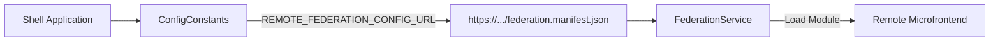

# Constants Module - Hằng số và cấu hình hệ thống

## Giới thiệu

Constants Module cung cấp các hằng số cốt lõi điều khiển responsive layout và hệ thống module federation trong ứng dụng. Tài liệu này tập trung vào ba nhóm hằng số quan trọng:

- **Breakpoint Definitions**: Định nghĩa breakpoint cho responsive design
- **Configuration & Federation**: Cấu hình module federation
- **View Type Management**: Quản lý trạng thái view (mobile/desktop)

## Các thành phần chính

| STT | Thành phần                    | Loại      | Mô tả ngắn                                    |
| --- | ----------------------------- | --------- | --------------------------------------------- |
| 1   | API Base State Type           | Type      | Quản lý trạng thái API với generic parameters |
| 2   | Breakpoint Definitions        | Constant  | Định nghĩa breakpoint cho responsive design   |
| 3   | Common Block Request          | Interface | Cấu trúc request cho các block component      |
| 4   | View Type Management          | Enum      | Quản lý trạng thái view mobile/desktop       |

### 1. API Base State Type

Type definition cho quản lý trạng thái API với generic key và data type:

```typescript
export type ApiBaseState<K extends string | number, T> = {
  results: Record<K, T>;
  isLoading: Record<K, boolean>;
  hasError: Record<K, Error | null>;
};
```

### 2. Breakpoint Definitions (Breakpoints)

Các giá trị định nghĩa media queries dùng để xác định thiết bị và kích thước màn hình:

```typescript
export const BREAKPOINTS_VALUE = {
  FOR_PHONE_ONLY: "(max-width: 599px)",
  FOR_TABLET_PORTRAIT_UP: "(min-width: 600px) and (max-width: 899px)",
  FOR_TABLET_LANDSCAPE_UP: "(min-width: 900px) and (max-width: 1199px)",
  FOR_DESKTOP_UP: "(min-width: 1200px) and (max-width: 1799px)",
  FOR_BIG_DESKTOP_UP: "(min-width: 1800px)"
};
```

| Tên Hằng                | Giá trị                                     | Mục tiêu thiết bị             |
| ----------------------- | ------------------------------------------- | ----------------------------- |
| FOR_PHONE_ONLY          | (max-width: 599px)                          | Điện thoại di động (portrait) |
| FOR_TABLET_PORTRAIT_UP  | (min-width: 600px) and (max-width: 899px)   | Tablet portrait               |
| FOR_TABLET_LANDSCAPE_UP | (min-width: 900px) and (max-width: 1199px)  | Tablet landscape              |
| FOR_DESKTOP_UP          | (min-width: 1200px) and (max-width: 1799px) | Desktop tiêu chuẩn            |
| FOR_BIG_DESKTOP_UP      | (min-width: 1800px)                         | Màn hình lớn (4K/UHD)         |

### 3. Common Block Request Interface

Interface định nghĩa cấu trúc request cho các block component:

```typescript
export interface CommonBlockReq {
  page_id: number;
  block_id: number;
  block_type_id: number;
}
```

### 4. View Type Management

Quản lý trạng thái view toàn hệ thống để xác định giao diện mobile/desktop:

```typescript
export enum ViewType {
  MOBILE = "mobile",
  DESKTOP = "desktop"
}
```

## Cách sử dụng

### Cách kết hợp các hằng số

```typescript
// Trong layout service
import { BREAKPOINTS_VALUE } from '@cci-web/core/constants';
import { ViewType } from '@cci-web/core/constants/view-type.enum';

constructor(private breakpointObserver: BreakpointObserver) {
  this.breakpointObserver
    .observe(BREAKPOINTS_VALUE.FOR_PHONE_ONLY)
    .subscribe(result => {
      const viewType = result.matches ? ViewType.MOBILE : ViewType.DESKTOP;
      // Cập nhật trạng thái view cho toàn hệ thống
      this.store.dispatch(updateViewType(viewType));
    });
}
```

### Cách sử dụng trong CSS

```scss
// Trong theme/styles.scss
@include media-breakpoint-down("phone") {
  .header {
    @include load-stylesheet("/assets/images/for-phone/header-mobile.png");
  }
}
```

## Ví dụ sử dụng

### Tạo ViewType Service

```typescript
// ViewTypeService.ts
import { BreakpointObserver } from "@angular/common/breakpoints";
import { Observable, Subject } from "rxjs";

export class ViewTypeService {
  private currentViewSubject = new Subject<ViewType>(ViewType.DESKTOP);

  constructor(private breakpointObserver: BreakpointObserver) {
    this.breakpointObserver
      .observe(BREAKPOINTS_VALUE.FOR_PHONE_ONLY)
      .subscribe((isMobile) => this.currentViewSubject.next(isMobile ? ViewType.MOBILE : ViewType.DESKTOP));
  }

  get currentView$(): Observable<ViewType> {
    return this.currentViewSubject.asObservable();
  }
}
```

### Tải manifest microfrontend

```typescript
// ShellBootstrap.ts
const loadFederationManifest = async () => {
  const response = await fetch(ConfigValues.REMOTE_FEDERATION_CONFIG_URL);
  if (!response.ok) throw new Error("Network error");

  return await response.json();
};

// Sử dụng kết quả trong ứng dụng
loadFederationManifest().then((manifest) => {
  manifest.home.forEach((module) => {
    import(module.url).then(() => renderModule(module.scope));
  });
});
```

## Quy trình tương tác

### Responsive Design Protocol

#### Breakpoint Detection

- Giao diện tự động xác định thiết bị qua BREAKPOINTS_VALUE
- Trigger sự kiện resize cửa sổ

#### View Type Update

- Cập nhật trạng thái ViewType dựa trên breakpoint
- Mobile: MOBILE, Desktop: DESKTOP

#### Template Selection

Chọn template phù hợp với ViewType:

```html
<!-- Trong main-layout.component.html -->
<ng-container *ngIf="(currentView$ | async) === 'mobile'">
  <mobile-header></mobile-header>
</ng-container>
```

### Microfrontend Workflow



## Bảng tổng hợp các thành phần

### Tổng quan các Types và Interfaces

| Thành phần         | Loại      | Mục đích sử dụng                    | Ví dụ sử dụng                           |
| ------------------ | --------- | ----------------------------------- | --------------------------------------- |
| ApiBaseState       | Type      | Quản lý trạng thái API calls        | `ApiBaseState<string, UserData>`        |
| BREAKPOINTS_VALUE  | Constant  | Responsive design breakpoints       | `FOR_PHONE_ONLY`, `FOR_DESKTOP_UP`      |
| CommonBlockReq     | Interface | Request structure cho blocks        | `{ page_id: 1, block_id: 2, block_type_id: 3 }` |
| ViewType           | Enum      | Định nghĩa loại view mobile/desktop | `ViewType.MOBILE`, `ViewType.DESKTOP`   |

### Tương tác giữa các thành phần

| Thành phần        | Tác động                     | Trạng thái đầu ra        | Dependency                |
| ----------------- | ---------------------------- | ------------------------ | ------------------------- |
| ApiBaseState      | Quản lý state API            | Loading/Error/Success    | Generic types K, T        |
| BREAKPOINTS_VALUE | Xác định kích thước màn hình | ViewType: MOBILE/DESKTOP | BreakpointObserver        |
| CommonBlockReq    | Cấu trúc request blocks      | API call parameters      | Backend API endpoints     |
| ViewType.enum     | Định nghĩa trạng thái view   | Template phù hợp         | BREAKPOINTS_VALUE         |

## Ghi chú quan trọng

::: warning Lưu ý quan trọng

- **Mobile-first design**: Tất cả component mới phải tuân thủ nguyên tắc mobile-first
- **CORS Validation**: Trong production, luôn cần xác thực HTTPS và CORS
- **Asset Loading Path**: Đường dẫn tài nguyên mobile: `/assets/images/for-phone/`
- **Error Handling**: Xử lý lỗi network ở `/app/features/layouts/stores`
  :::

## Tóm tắt

Tài liệu này kết hợp các hằng số cốt lõi để điều khiển responsive design và hệ thống module federation, đảm bảo ứng dụng hoạt động trơn chuột qua tất cả thiết bị từ điện thoại đến màn hình lớn UHD.
