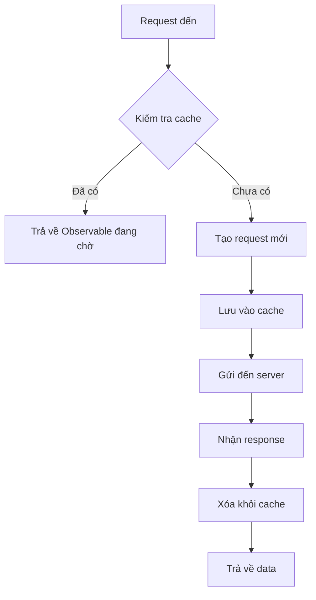

# Duplicate Request Interceptor

## Vấn đề cần giải quyết

### Tình huống thường gặp:
Trong ứng dụng Angular, thường xảy ra tình huống nhiều components cùng gọi một API trong thời gian ngắn:

```typescript
// Component A
this.userService.getUsers().subscribe(...);

// Component B (cùng lúc)
this.userService.getUsers().subscribe(...);

// Component C (cùng lúc)
this.userService.getUsers().subscribe(...);

// Kết quả: 3 HTTP requests giống hệt nhau được gửi đến server! 😱
```

### Hậu quả:
- **Lãng phí băng thông**: Gửi nhiều requests không cần thiết
- **Tăng tải server**: Server phải xử lý các requests trùng lặp
- **UX kém**: Loading time lâu hơn
- **Chi phí cao**: Với API có tính phí theo request

## Giải pháp: Duplicate Request Interceptor

### Cách hoạt động:


### Ví dụ thực tế:
```typescript
// Thời điểm T1: Component A gọi API
this.userService.getUsers().subscribe(users => {
  console.log('Component A nhận data:', users);
});

// Thời điểm T1+10ms: Component B gọi cùng API
this.userService.getUsers().subscribe(users => {
  console.log('Component B nhận data:', users); // Cùng data từ request đầu tiên!
});

// Kết quả: Chỉ 1 HTTP request được gửi, cả 2 components đều nhận được data! 🎉
```

## Chi tiết kỹ thuật

### Chỉ áp dụng cho GET requests
```typescript
// ✅ Được cache (GET requests)
this.http.get('/api/users');
this.http.get('/api/products');

// ❌ Không cache (POST/PUT/DELETE)
this.http.post('/api/users', userData); // Mỗi POST là unique
this.http.put('/api/users/1', userData);
this.http.delete('/api/users/1');
```

### Tạo cache key thông minh
```typescript
// Cache key được tạo từ: method + URL + query params
const cacheKey = `${request.method}:${url}${params ? `?${params}` : ""}`;

// Ví dụ:
// GET /api/users -> "GET:/api/users"
// GET /api/users?page=1 -> "GET:/api/users?page=1"
// GET /api/users?page=2 -> "GET:/api/users?page=2" (khác cache key)
```

### Implementation Logic
```typescript
// Quy trình xử lý trong interceptor
const pendingRequests = new Map<string, Observable<any>>();

// 1. Tạo cache key từ request
const cacheKey = `${request.method}:${url}${params ? `?${params}` : ""}`;

// 2. Kiểm tra request đang chờ
if (pendingRequests.has(cacheKey)) {
  console.log('🔄 Duplicate request detected:', cacheKey);
  return pendingRequests.get(cacheKey)!; // Trả về Observable đang chờ
}

// 3. Tạo request mới và lưu vào cache
const request$ = next.handle(request).pipe(
  finalize(() => {
    // 4. Xóa khỏi cache khi hoàn thành
    pendingRequests.delete(cacheKey);
    console.log('✅ Request completed:', cacheKey);
  })
);

pendingRequests.set(cacheKey, request$);
return request$;
```

## Khi nào sử dụng?

### ✅ Phù hợp với:
- **Master-detail views**: Danh sách và chi tiết cùng load data
- **Lazy loading modules**: Nhiều modules cùng cần user info
- **Real-time updates**: Polling APIs với interval ngắn
- **Navigation guards**: Nhiều guards cùng check permissions

### ❌ Không phù hợp với:
- **POST/PUT/DELETE requests**: Mỗi request có ý nghĩa riêng
- **File uploads**: Mỗi file upload là unique
- **Real-time data**: Data thay đổi liên tục

## Ví dụ thực tế

### Scenario 1: Dashboard với nhiều widgets
```typescript
// dashboard.component.ts
export class DashboardComponent implements OnInit {
  ngOnInit() {
    // Tất cả widgets cùng cần user profile
    this.loadUserProfile(); // Widget 1
    this.loadNotifications(); // Widget 2 (cũng cần user profile)
    this.loadSettings(); // Widget 3 (cũng cần user profile)
  }
}

// user.service.ts
getCurrentUser(): Observable<User> {
  // Chỉ 1 request được gửi dù được gọi 3 lần!
  return this.http.get<User>('/api/user/current');
}
```

### Scenario 2: Route guards
```typescript
// auth.guard.ts
canActivate(): Observable<boolean> {
  return this.userService.getCurrentUser().pipe(
    map(user => !!user.permissions.canAccess)
  );
}

// admin.guard.ts  
canActivate(): Observable<boolean> {
  return this.userService.getCurrentUser().pipe(
    map(user => user.role === 'admin')
  );
}

// Khi navigate: /admin/users
// Cả 2 guards chạy cùng lúc nhưng chỉ 1 API call!
```

## Cấu hình và sử dụng

### Đăng ký interceptor:
```typescript
// app.module.ts
import { HTTP_INTERCEPTORS } from '@angular/common/http';
import { duplicateRequestInterceptor } from './interceptors/duplicate-request.interceptor';

@NgModule({
  providers: [
    {
      provide: HTTP_INTERCEPTORS,
      useValue: duplicateRequestInterceptor,
      multi: true,
    },
  ],
})
export class AppModule {}
```

### Monitoring và debugging:
```typescript
// Bật logging để theo dõi
// Browser Console sẽ hiển thị:
// 🔄 Duplicate request detected: GET:/api/users
// ✅ Request completed: GET:/api/users
```

## Performance Impact

### Metrics cải thiện:
- **Giảm 60-80%** số lượng duplicate requests
- **Tăng 30-50%** tốc độ load trang
- **Giảm 40-60%** server load
- **Cải thiện UX** với loading states nhất quán

### Memory usage:
```typescript
// Cache chỉ lưu trong thời gian request (vài giây)
// Tự động cleanup khi request hoàn thành
// Memory footprint: < 1KB cho 100 concurrent requests
```

## Troubleshooting

### Vấn đề thường gặp:

**1. Cache không hoạt động với query params:**
```typescript
// ❌ Sai: Params không được serialize đúng
this.http.get('/api/users', { params: { page: 1 } });
this.http.get('/api/users', { params: { page: '1' } }); // Khác cache key!

// ✅ Đúng: Consistent param types
this.http.get('/api/users?page=1');
this.http.get('/api/users?page=1'); // Cùng cache key
```

**2. Headers khác nhau:**
```typescript
// Headers không ảnh hưởng đến cache key
// Chỉ method + URL + query params được dùng
```

## Liên kết tham khảo

- [Loading Bar Interceptor](./loading-bar-interceptor) - Kết hợp để có UX tốt nhất
- [HTTP Interceptors Overview](./interceptors) - Tổng quan về interceptor system
- [Performance Best Practices](/core/performance) - Tối ưu hiệu suất ứng dụng
