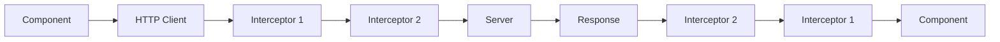

# HTTP Interceptors

## Giới thiệu

HTTP Interceptors là các lớp trung gian trong Angular cho phép bạn can thiệp vào quá trình xử lý HTTP requests và responses. Chúng hoạt động như một "bộ lọc" giữa ứng dụng và server, cho phép bạn:

- **Thêm headers** vào tất cả requests (authentication token, content-type, v.v.)
- **Xử lý lỗi** một cách tập trung
- **Hiển thị loading** khi có requests đang chạy
- **Cache responses** để tối ưu hiệu suất
- **Log requests** để debug và monitoring

## Tại sao cần sử dụng Interceptors?

### Vấn đề thường gặp:
- Phải thêm authentication token vào từng service riêng lẻ
- Xử lý lỗi HTTP lặp lại ở nhiều nơi
- Không có cách thống nhất để hiển thị loading state
- Khó debug các API calls

### Giải pháp với Interceptors:
```typescript
// Thay vì làm thế này ở mỗi service:
this.http.get('/api/users', {
  headers: { 'Authorization': 'Bearer ' + token }
}).subscribe(...);

// Interceptor tự động thêm header cho tất cả requests:
this.http.get('/api/users').subscribe(...);
```

## Các loại Interceptors trong hệ thống

Hệ thống cung cấp 2 interceptors chính:

### 1. Loading Bar Interceptor
- **Mục đích**: Theo dõi số lượng HTTP requests đang chạy
- **Chức năng**: Hiển thị/ẩn loading bar dựa trên trạng thái requests
- **Sử dụng khi**: Muốn có loading indicator toàn cục

### 2. Duplicate Request Interceptor  
- **Mục đích**: Ngăn chặn các GET requests trùng lặp
- **Chức năng**: Cache requests đang chờ, tránh gọi API không cần thiết
- **Sử dụng khi**: Có nhiều components cùng gọi một API

## Cách hoạt động của Interceptors

### Luồng xử lý request:


### Ví dụ thực tế:
```typescript
// 1. Component gọi API
this.userService.getUsers().subscribe(users => {
  this.users = users;
});

// 2. Loading Interceptor bắt đầu đếm request
// 3. Duplicate Request Interceptor kiểm tra cache
// 4. Request được gửi đến server (nếu chưa có trong cache)
// 5. Response trả về qua các interceptors theo thứ tự ngược lại
// 6. Component nhận được data
```

## Cấu hình và sử dụng

### Bước 1: Import các interceptors
```typescript
// app.module.ts
import { HTTP_INTERCEPTORS } from '@angular/common/http';
import { loadingBarInterceptor } from './interceptors/loading-bar.interceptor';
import { duplicateRequestInterceptor } from './interceptors/duplicate-request.interceptor';
```

### Bước 2: Đăng ký trong providers
```typescript
@NgModule({
  providers: [
    // Loading Bar Interceptor - theo dõi requests
    {
      provide: HTTP_INTERCEPTORS,
      useValue: loadingBarInterceptor,
      multi: true,
    },
    // Duplicate Request Interceptor - ngăn requests trùng lặp
    {
      provide: HTTP_INTERCEPTORS,
      useValue: duplicateRequestInterceptor,
      multi: true,
    },
  ],
})
export class AppModule {}
```

### Bước 3: Sử dụng trong services
```typescript
// user.service.ts
@Injectable()
export class UserService {
  constructor(private http: HttpClient) {}

  getUsers(): Observable<User[]> {
    // Interceptors sẽ tự động xử lý:
    // - Thêm loading state
    // - Kiểm tra duplicate requests
    // - Log request information
    return this.http.get<User[]>('/api/users');
  }
}
```

## Lợi ích khi sử dụng

### ✅ Ưu điểm:
- **Tập trung hóa**: Xử lý logic chung ở một nơi
- **Tự động hóa**: Không cần can thiệp thủ công vào từng request
- **Hiệu suất**: Giảm thiểu requests không cần thiết
- **UX tốt hơn**: Loading states nhất quán
- **Dễ maintain**: Thay đổi logic ở một nơi, áp dụng toàn bộ app

### ⚠️ Lưu ý:
- Thứ tự đăng ký interceptors quan trọng
- Cần xử lý errors trong interceptors
- Tránh tạo infinite loops trong interceptors

## Troubleshooting

### Vấn đề thường gặp:

**1. Interceptor không hoạt động:**
```typescript
// ❌ Sai: Quên set multi: true
{
  provide: HTTP_INTERCEPTORS,
  useValue: myInterceptor,
  // multi: true, // <- Thiếu dòng này
}

// ✅ Đúng:
{
  provide: HTTP_INTERCEPTORS,
  useValue: myInterceptor,
  multi: true, // <- Bắt buộc phải có
}
```

**2. Thứ tự interceptors sai:**
```typescript
// Interceptors chạy theo thứ tự đăng ký
// Request: A -> B -> C -> Server
// Response: Server -> C -> B -> A
```

## Liên kết tham khảo

- [Loading Bar Interceptor](./loading-bar-interceptor) - Chi tiết về loading state management
- [Duplicate Request Interceptor](./duplicate-request-interceptor) - Ngăn chặn requests trùng lặp
- [Loading Service Implementation](/core/services/loading.service) - Service hỗ trợ loading states
