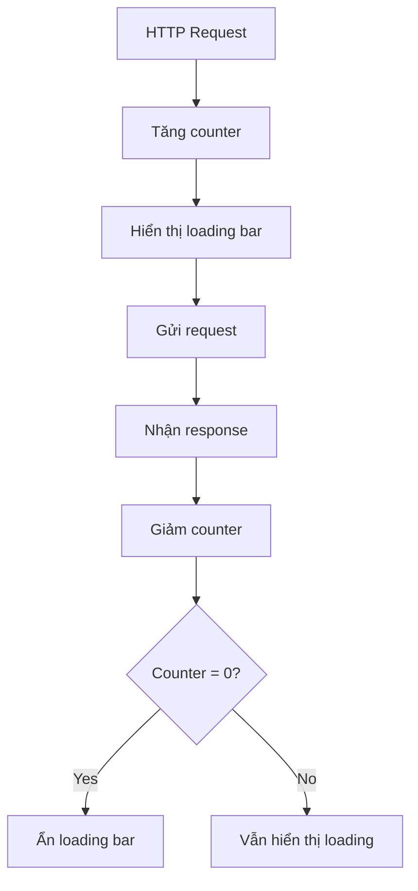

# Loading Bar Interceptor

## Vấn đề cần giải quyết

### Tình huống thường gặp:
Trong ứng dụng web, người dùng cần biết khi nào ứng dụng đang tải dữ liệu:

```typescript
// Không có loading indicator
this.userService.getUsers().subscribe(users => {
  this.users = users; // User không biết đang loading
});

// Phải tự quản lý loading state ở mỗi component
export class UserComponent {
  loading = false;
  
  loadUsers() {
    this.loading = true; // 😫 Phải nhớ set loading
    this.userService.getUsers().subscribe({
      next: users => {
        this.users = users;
        this.loading = false; // 😫 Phải nhớ tắt loading
      },
      error: () => {
        this.loading = false; // 😫 Phải nhớ tắt loading cả khi lỗi
      }
    });
  }
}
```

### Hậu quả:
- **UX kém**: User không biết app có đang hoạt động không
- **Code lặp lại**: Mỗi component phải tự quản lý loading state
- **Dễ quên**: Quên tắt loading khi có lỗi
- **Không nhất quán**: Loading UI khác nhau ở các màn hình

## Giải pháp: Loading Bar Interceptor

### Cách hoạt động:


### Ví dụ thực tế:
```typescript
// Component chỉ cần gọi API, không cần quản lý loading!
export class UserComponent {
  loadUsers() {
    // Loading bar tự động hiện/ẩn! 🎉
    this.userService.getUsers().subscribe(users => {
      this.users = users;
    });
  }
  
  loadProducts() {
    // Nếu gọi đồng thời, loading bar vẫn hiển thị cho đến khi tất cả hoàn thành
    this.productService.getProducts().subscribe(products => {
      this.products = products;
    });
  }
}
```

## Chi tiết kỹ thuật

### Theo dõi requests theo nhóm
```typescript
// Tạo request key để nhóm các requests liên quan
const requestKey = `${request.method}:${this.getBaseUrl(request.url)}`;

// Ví dụ:
// GET /api/users/1 -> "GET:/api/users"
// GET /api/users/2 -> "GET:/api/users" (cùng nhóm)
// POST /api/users -> "POST:/api/users" (khác nhóm)
```

### Quản lý bộ đếm thông minh
```typescript
const activeRequests = new Map<string, number>();

// Khi request bắt đầu
const currentCount = activeRequests.get(requestKey) || 0;
activeRequests.set(requestKey, currentCount + 1);
console.log(`🚀 Starting request: ${requestKey} (${currentCount + 1} active)`);

// Khi request kết thúc
const count = activeRequests.get(requestKey) || 0;
if (count <= 1) {
  activeRequests.delete(requestKey);
  console.log(`✅ All requests completed for: ${requestKey}`);
} else {
  activeRequests.set(requestKey, count - 1);
  console.log(`⏳ ${count - 1} requests still active for: ${requestKey}`);
}
```

## Khi nào sử dụng?

### ✅ Phù hợp với:
- **API calls từ user actions**: Click button, submit form
- **Page navigation**: Load data khi chuyển trang
- **Background sync**: Periodic data updates
- **File operations**: Upload/download files

### ❌ Không phù hợp với:
- **Real-time updates**: WebSocket, SSE
- **Polling với interval ngắn**: < 5 giây
- **Analytics tracking**: Silent background calls

## Ví dụ thực tế

### Scenario 1: E-commerce product page
```typescript
// product.component.ts
export class ProductComponent implements OnInit {
  ngOnInit() {
    // Tất cả calls này sẽ được track bởi loading bar
    this.loadProduct();     // Request 1
    this.loadReviews();     // Request 2  
    this.loadRelated();     // Request 3
    
    // Loading bar hiển thị cho đến khi cả 3 requests hoàn thành
  }
  
  private loadProduct() {
    this.productService.getProduct(this.id).subscribe(product => {
      this.product = product;
    });
  }
}
```

### Scenario 2: Form submission với validation
```typescript
// user-form.component.ts
export class UserFormComponent {
  onSubmit() {
    // Loading bar tự động hiện khi submit
    this.userService.createUser(this.form.value).subscribe({
      next: user => {
        this.router.navigate(['/users', user.id]);
        // Loading bar tự động ẩn
      },
      error: error => {
        this.showError(error);
        // Loading bar vẫn tự động ẩn kể cả khi lỗi
      }
    });
  }
}
```

## Integration với Loading Service

### Loading Service Interface
```typescript
// loading.service.ts
@Injectable()
export class LoadingService {
  private loadingSubject = new BehaviorSubject<boolean>(false);
  public loading$ = this.loadingSubject.asObservable();
  
  // Được gọi bởi Loading Bar Interceptor
  setLoading(loading: boolean, requestKey?: string) {
    this.loadingSubject.next(loading);
  }
  
  // Cho phép components check loading state
  isLoading(): boolean {
    return this.loadingSubject.value;
  }
}
```

### Global Loading Component
```typescript
// loading-bar.component.ts
@Component({
  selector: 'app-loading-bar',
  template: `
    <div class="loading-bar" *ngIf="loading$ | async">
      <div class="progress-bar"></div>
    </div>
  `,
  styles: [`
    .loading-bar {
      position: fixed;
      top: 0;
      left: 0;
      width: 100%;
      height: 3px;
      background: rgba(0,0,0,0.1);
      z-index: 9999;
    }
    .progress-bar {
      height: 100%;
      background: linear-gradient(90deg, #007bff, #28a745);
      animation: loading 2s infinite;
    }
    @keyframes loading {
      0% { width: 0%; }
      50% { width: 70%; }
      100% { width: 100%; }
    }
  `]
})
export class LoadingBarComponent {
  loading$ = this.loadingService.loading$;
  
  constructor(private loadingService: LoadingService) {}
}
```

## Cấu hình và sử dụng

### Bước 1: Đăng ký interceptor và service
```typescript
// app.module.ts
import { HTTP_INTERCEPTORS } from '@angular/common/http';
import { loadingBarInterceptor } from './interceptors/loading-bar.interceptor';
import { LoadingService } from './services/loading.service';

@NgModule({
  providers: [
    LoadingService,
    {
      provide: HTTP_INTERCEPTORS,
      useValue: loadingBarInterceptor,
      multi: true,
    },
  ],
})
export class AppModule {}
```

### Bước 2: Thêm loading bar vào app
```html
<!-- app.component.html -->
<app-loading-bar></app-loading-bar>
<router-outlet></router-outlet>
```

### Bước 3: Sử dụng trong components (optional)
```typescript
// Nếu cần custom loading logic
export class CustomComponent {
  constructor(private loadingService: LoadingService) {}
  
  // Check loading state
  get isLoading() {
    return this.loadingService.isLoading();
  }
  
  // Listen to loading changes
  ngOnInit() {
    this.loadingService.loading$.subscribe(loading => {
      if (loading) {
        console.log('App is loading...');
      } else {
        console.log('App finished loading');
      }
    });
  }
}
```

## Advanced Features

### Selective loading tracking
```typescript
// Bỏ qua một số requests khỏi loading bar
const skipLoadingUrls = ['/api/analytics', '/api/heartbeat'];

if (skipLoadingUrls.some(url => request.url.includes(url))) {
  return next.handle(request); // Không track loading
}
```

### Request timeout handling
```typescript
// Tự động ẩn loading nếu request quá lâu
const request$ = next.handle(request).pipe(
  timeout(30000), // 30 seconds timeout
  catchError(error => {
    // Đảm bảo loading được tắt khi timeout
    this.updateLoadingState(requestKey, false);
    return throwError(error);
  })
);
```

## Performance Considerations

### Debouncing cho UX tốt hơn
```typescript
// Chỉ hiển thị loading nếu request > 200ms
const showLoadingDelay = 200;
const hideLoadingDelay = 100;

// Tránh loading bar nhấp nháy với requests nhanh
```

### Memory management
```typescript
// Cleanup inactive request keys
setInterval(() => {
  activeRequests.forEach((count, key) => {
    if (count <= 0) {
      activeRequests.delete(key);
    }
  });
}, 60000); // Cleanup mỗi phút
```

## Troubleshooting

### Vấn đề thường gặp:

**1. Loading bar không ẩn:**
```typescript
// Nguyên nhân: Request bị lỗi nhưng không được handle
// Giải pháp: Luôn dùng finalize() operator
return next.handle(request).pipe(
  finalize(() => {
    this.updateLoadingState(requestKey, false);
  })
);
```

**2. Loading bar hiển thị cho requests không mong muốn:**
```typescript
// Thêm whitelist/blacklist URLs
const excludeUrls = ['/api/config', '/api/version'];
if (excludeUrls.includes(request.url)) {
  return next.handle(request);
}
```

## Liên kết tham khảo

- [Duplicate Request Interceptor](./duplicate-request-interceptor) - Kết hợp để tối ưu performance
- [HTTP Interceptors Overview](./interceptors) - Tổng quan về interceptor system
- [Loading Service Implementation](/core/services/loading.service) - Chi tiết về Loading Service
