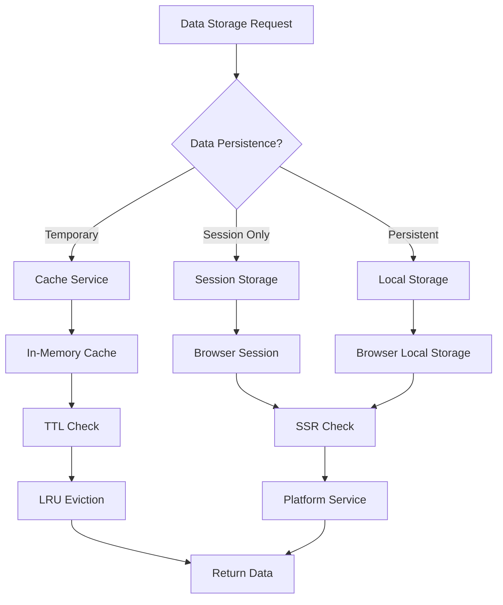
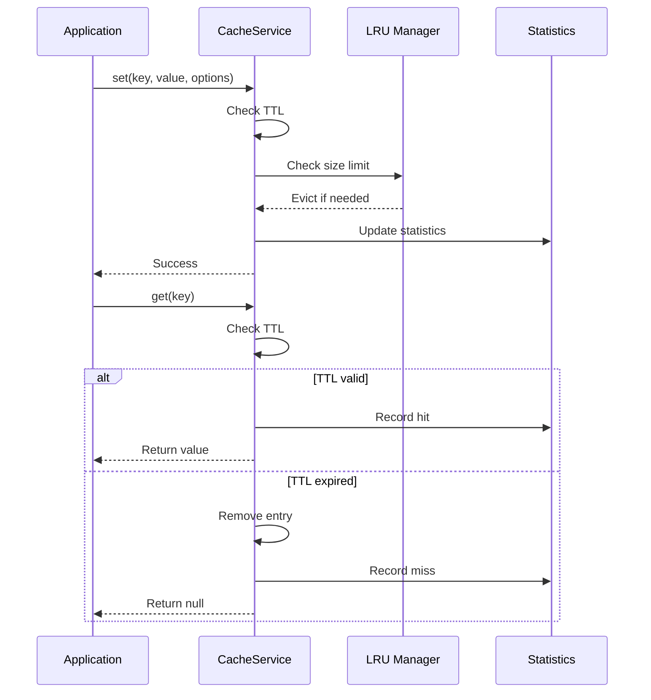

# Storage Module - Hệ thống quản lý lưu trữ dữ liệu

## Giới thiệu

Storage Module cung cấp hệ thống quản lý lưu trữ dữ liệu toàn diện cho ứng dụng Angular, bao gồm cache memory, local storage, session storage với hỗ trợ SSR và type safety. Tài liệu này tập trung vào bốn thành phần chính:

- **Browser Storage Base Interface**: Interface cơ sở cho tất cả storage services
- **Cache Service**: Hệ thống cache memory với TTL và LRU eviction
- **Local Storage Service**: Wrapper cho localStorage với SSR support
- **Session Storage Service**: Wrapper cho sessionStorage với SSR support

## Các thành phần chính

| STT | Thành phần                     | Loại      | Mô tả ngắn                                         |
| --- | ------------------------------ | --------- | -------------------------------------------------- |
| 1   | Browser Storage Base Interface | Interface | Interface cơ sở cho tất cả storage implementations |
| 2   | Cache Service                  | Service   | In-memory cache với TTL và LRU eviction policy     |
| 3   | Local Storage Service          | Service   | SSR-safe wrapper cho localStorage API              |
| 4   | Session Storage Service        | Service   | SSR-safe wrapper cho sessionStorage API            |

### 1. Browser Storage Base Interface

Interface cơ sở định nghĩa API chung cho tất cả storage implementations:

#### Các phương thức chính

| Phương thức | Tham số | Trả về | Mô tả |
|-------------|---------|--------|---------|
| `set()` | `key: string, value: T, options?: StorageOptions` | `void` | Lưu trữ dữ liệu với key |
| `get()` | `key: string` | `T \| null` | Lấy dữ liệu theo key |
| `has()` | `key: string` | `boolean` | Kiểm tra key có tồn tại không |
| `remove()` | `key: string` | `void` | Xóa dữ liệu theo key |
| `clear()` | - | `void` | Xóa tất cả dữ liệu |
| `keys()` | - | `string[]` | Lấy danh sách tất cả keys |
| `size` | - | `number` | Lấy số lượng items trong storage |

#### Extended Interfaces

**CacheStorageBase** - Interface cho cache với thống kê:

| Phương thức | Tham số | Trả về | Mô tả |
|-------------|---------|--------|-------|
| `getStats()` | - | `CacheStats` | Lấy thống kê cache |
| `setMaxSize()` | `maxSize: number` | `void` | Thiết lập kích thước tối đa |

**StorageOptions** - Tùy chọn lưu trữ:

| Thuộc tính | Kiểu | Mô tả |
|------------|------|-------|
| `ttl?` | `number` | Time to live (milliseconds) |
| `metadata?` | `Record<string, any>` | Metadata bổ sung |

**CacheStats** - Thống kê cache:

| Thuộc tính | Kiểu | Mô tả |
|------------|------|-------|
| `size` | `number` | Số lượng items trong cache |
| `hits` | `number` | Số lần truy cập thành công |
| `misses` | `number` | Số lần truy cập thất bại |
| `hitRate` | `number` | Tỷ lệ hit rate |
| `maxSize` | `number` | Kích thước tối đa |

**StorageEntry** - Entry trong storage:

| Thuộc tính | Kiểu | Mô tả |
|------------|------|-------|
| `value` | `T` | Dữ liệu |
| `createdAt` | `number` | Thời gian tạo |
| `expiresAt?` | `number` | Thời gian hết hạn |
| `lastAccessed` | `number` | Thời gian truy cập cuối |
| `metadata?` | `Record<string, any>` | Metadata |

**StorageEvent** - Event khi storage thay đổi:

| Thuộc tính | Kiểu | Mô tả |
|------------|------|-------|
| `type` | `"set" \| "remove" \| "clear"` | Loại event |
| `key?` | `string` | Key bị thay đổi |
| `oldValue?` | `T` | Giá trị cũ |
| `newValue?` | `T` | Giá trị mới |
| `timestamp` | `number` | Timestamp |

**ObservableStorageBase** - Interface cho observable storage:

| Thuộc tính/Phương thức | Tham số | Trả về | Mô tả |
|------------------------|---------|--------|-------|
| `events$` | - | `Observable<StorageEvent<T>>` | Observable cho storage events |
| `watch()` | `key: string` | `Observable<T \| null>` | Observable cho một key cụ thể |

### 2. Cache Service

Service quản lý cache memory với TTL và LRU eviction policy:

#### Các phương thức chính

| Phương thức | Tham số | Trả về | Mô tả |
|-------------|---------|--------|---------|
| `set()` | `key: string, value: T, options?: StorageOptions` | `void` | Lưu trữ dữ liệu vào cache với LRU eviction |
| `get()` | `key: string` | `T \| null` | Lấy dữ liệu từ cache, kiểm tra TTL |
| `has()` | `key: string` | `boolean` | Kiểm tra key có tồn tại và chưa hết hạn |
| `remove()` | `key: string` | `void` | Xóa entry khỏi cache |
| `clear()` | - | `void` | Xóa tất cả entries |
| `getStats()` | - | `CacheStats` | Lấy thống kê cache (hits, misses, hit rate) |
| `setMaxSize()` | `maxSize: number` | `void` | Thiết lập kích thước tối đa |

#### Tính năng đặc biệt

- **LRU Eviction**: Tự động xóa entries ít được sử dụng nhất khi đạt maxSize
- **TTL Support**: Hỗ trợ thời gian hết hạn cho từng entry
- **Statistics**: Theo dõi hits, misses và hit rate để đánh giá hiệu suất
- **Access Tracking**: Theo dõi thời gian truy cập để thực hiện LRU
- **Metadata**: Lưu trữ thông tin bổ sung cho mỗi entry

### 3. Local Storage Service

SSR-safe wrapper cho localStorage API:

#### Các phương thức chính

| Phương thức | Tham số | Trả về | Mô tả |
|-------------|---------|--------|---------||
| `set()` | `key: string, value: string, options?: StorageOptions` | `void` | Lưu trữ dữ liệu vào localStorage với TTL |
| `get()` | `key: string` | `string \| null` | Lấy dữ liệu từ localStorage, kiểm tra TTL |
| `has()` | `key: string` | `boolean` | Kiểm tra key có tồn tại và chưa hết hạn |
| `remove()` | `key: string` | `void` | Xóa entry khỏi localStorage |
| `clear()` | - | `void` | Xóa tất cả entries |
| `keys()` | - | `string[]` | Lấy danh sách tất cả keys |
| `size` | - | `number` | Lấy số lượng items |

#### Tính năng đặc biệt

- **SSR Safe**: Kiểm tra `isBrowser()` trước khi truy cập localStorage
- **Error Handling**: Xử lý lỗi khi localStorage không khả dụng
- **Auto Serialization**: Tự động serialize/deserialize objects với StorageEntry
- **TTL Support**: Hỗ trợ thời gian hết hạn cho entries
- **Metadata**: Lưu trữ thông tin bổ sung (createdAt, lastAccessed)
- **Access Tracking**: Cập nhật lastAccessed khi get data

### 4. Session Storage Service

SSR-safe wrapper cho sessionStorage API:

#### Các phương thức chính

| Phương thức | Tham số | Trả về | Mô tả |
|-------------|---------|--------|---------||
| `set()` | `key: string, value: string, options?: StorageOptions` | `void` | Lưu trữ dữ liệu vào sessionStorage với TTL |
| `get()` | `key: string` | `string \| null` | Lấy dữ liệu từ sessionStorage, kiểm tra TTL |
| `has()` | `key: string` | `boolean` | Kiểm tra key có tồn tại và chưa hết hạn |
| `remove()` | `key: string` | `void` | Xóa entry khỏi sessionStorage |
| `clear()` | - | `void` | Xóa tất cả entries |
| `keys()` | - | `string[]` | Lấy danh sách tất cả keys |
| `size` | - | `number` | Lấy số lượng items |

#### Tính năng đặc biệt

- **Session Scope**: Dữ liệu chỉ tồn tại trong phiên làm việc hiện tại
- **SSR Safe**: Kiểm tra `isBrowser()` trước khi truy cập sessionStorage
- **Error Handling**: Xử lý lỗi khi sessionStorage không khả dụng
- **Auto Serialization**: Tự động serialize/deserialize objects với StorageEntry
- **TTL Support**: Hỗ trợ thời gian hết hạn cho entries
- **Metadata**: Lưu trữ thông tin bổ sung (createdAt, lastAccessed)
- **Access Tracking**: Cập nhật lastAccessed khi get data

## Cách sử dụng

### 1. Cache Service

#### Các thao tác cơ bản

| Thao tác | Code | Mô tả |
|----------|------|-------|
| Lưu trữ với TTL | `cacheService.set('key', data, { ttl: 300000 })` | Lưu 5 phút |
| Lấy dữ liệu | `const data = cacheService.get('key')` | Trả về null nếu hết hạn |
| Kiểm tra thống kê | `const stats = cacheService.getStats()` | Xem hit rate, size |
| Thiết lập max size | `cacheService.setMaxSize(200)` | Giới hạn 200 entries |

#### Ví dụ sử dụng trong Component

```typescript
@Component({
  selector: "app-product-list",
  templateUrl: "./product-list.component.html",
})
export class ProductListComponent {
  constructor(private cacheService: CacheService) {}

  loadProducts() {
    // Kiểm tra cache trước
    const cached = this.cacheService.get('products');
    if (cached) return cached;
    
    // Load và cache kết quả
    return this.api.getProducts().pipe(
      tap(data => this.cacheService.set('products', data, { ttl: 300000 }))
    );
  }
}
```

### 2. Local Storage Service

#### Các thao tác cơ bản

| Thao tác | Code | Mô tả |
|----------|------|-------|
| Lưu với TTL | `localStorage.set('settings', data, { ttl: 86400000 })` | Lưu 24 giờ |
| Lưu với metadata | `localStorage.set('key', data, { metadata: { v: '1.0' } })` | Kèm thông tin phiên bản |
| Lấy dữ liệu | `const data = localStorage.get('settings')` | Auto deserialize |
| Kiểm tra tồn tại | `if (localStorage.has('key')) { ... }` | Kiểm tra key + TTL |

#### Ví dụ User Preferences Service

```typescript
@Injectable({ providedIn: "root" })
export class UserPreferencesService {
  constructor(private localStorage: LocalStorageService) {}

  save(prefs: UserPreferences) {
    this.localStorage.set('user-prefs', JSON.stringify(prefs), 
      { ttl: 30 * 24 * 60 * 60 * 1000 }); // 30 ngày
  }

  get(): UserPreferences | null {
    const data = this.localStorage.get('user-prefs');
    return data ? JSON.parse(data) : null;
  }
}
```

### 3. Session Storage Service

#### Các thao tác cơ bản

| Thao tác | Code | Mô tả |
|----------|------|-------|
| Lưu dữ liệu session | `sessionStorage.set('temp-data', data)` | Chỉ tồn tại trong session |
| Lấy dữ liệu | `const data = sessionStorage.get('temp-data')` | Trả về null nếu không có |
| Xóa khi đóng tab | Tự động | SessionStorage tự xóa khi đóng tab |

#### Ví dụ Shopping Cart Service

```typescript
@Injectable({ providedIn: "root" })
export class ShoppingCartService {
  constructor(private sessionStorage: SessionStorageService) {}

  saveCart(cart: CartItem[]) {
    this.sessionStorage.set('cart', JSON.stringify(cart));
  }

  getCart(): CartItem[] {
    const data = this.sessionStorage.get('cart');
    return data ? JSON.parse(data) : [];
  }
}
```

## Ví dụ sử dụng nâng cao

### Tạo Storage Factory Service

```typescript
import { Injectable } from "@angular/core";
import { BrowserStorageBase } from "@cci-web/core/storage";

export type StorageType = "cache" | "localStorage" | "sessionStorage";

@Injectable({
  providedIn: "root",
})
export class StorageFactory {
  constructor(
    private cacheService: CacheService,
    private localStorageService: LocalStorageService,
    private sessionStorageService: SessionStorageService
  ) {}

  getStorage(type: StorageType): BrowserStorageBase {
    switch (type) {
      case "cache":
        return this.cacheService;
      case "localStorage":
        return this.localStorageService;
      case "sessionStorage":
        return this.sessionStorageService;
      default:
        throw new Error(`Unknown storage type: ${type}`);
    }
  }
}
```

### Tạo Generic Storage Service

```typescript
@Injectable({
  providedIn: "root",
})
export class GenericStorageService<T> {
  constructor(
    private storageFactory: StorageFactory,
    @Inject("STORAGE_TYPE") private storageType: StorageType,
    @Inject("KEY_PREFIX") private keyPrefix: string
  ) {}

  private get storage(): BrowserStorageBase {
    return this.storageFactory.getStorage(this.storageType);
  }

  private getKey(key: string): string {
    return `${this.keyPrefix}:${key}`;
  }

  set(key: string, value: T, options?: StorageOptions): void {
    const serialized = JSON.stringify(value);
    this.storage.set(this.getKey(key), serialized, options);
  }

  get(key: string): T | null {
    const data = this.storage.get(this.getKey(key));
    return data ? JSON.parse(data) : null;
  }

  has(key: string): boolean {
    return this.storage.has(this.getKey(key));
  }

  remove(key: string): void {
    this.storage.remove(this.getKey(key));
  }

  clear(): void {
    const keys = this.storage.keys();
    const prefixedKeys = keys.filter((k) => k.startsWith(this.keyPrefix));
    prefixedKeys.forEach((key) => this.storage.remove(key));
  }
}
```

## Quy trình tương tác

### Storage Selection Flow



### Cache Management Workflow



## Bảng tổng hợp các thành phần

### Tổng quan các Services

| Service               | Storage Type | Persistence | SSR Safe | TTL Support | LRU Eviction |
| --------------------- | ------------ | ----------- | -------- | ----------- | ------------ |
| CacheService          | Memory       | No          | Yes      | Yes         | Yes          |
| LocalStorageService   | Disk         | Yes         | Yes      | Yes         | No           |
| SessionStorageService | Memory       | Session     | Yes      | Yes         | No           |

### So sánh tính năng

| Tính năng             | Cache Service | Local Storage | Session Storage |
| --------------------- | ------------- | ------------- | --------------- |
| **Performance**       | Rất cao       | Trung bình    | Trung bình      |
| **Capacity**          | RAM limit     | ~5-10MB       | ~5-10MB         |
| **Persistence**       | Không         | Có            | Session only    |
| **Cross-tab sharing** | Không         | Có            | Không           |
| **SSR Support**       | Có            | Có            | Có              |
| **Type Safety**       | Generic       | String only   | String only     |
| **Statistics**        | Có            | Không         | Không           |
| **Auto Eviction**     | LRU           | Manual        | Manual          |

### Use Cases phù hợp

| Use Case              | Recommended Storage | Lý do                                |
| --------------------- | ------------------- | ------------------------------------ |
| API Response Caching  | Cache Service       | High performance, TTL, auto eviction |
| User Preferences      | Local Storage       | Persistent across sessions           |
| Shopping Cart         | Session Storage     | Session-specific, auto cleanup       |
| Authentication Tokens | Local Storage       | Persistent, secure                   |
| Temporary Form Data   | Cache Service       | Fast access, auto cleanup            |
| Theme Settings        | Local Storage       | User preference, persistent          |
| Search History        | Local Storage       | User data, cross-session             |
| Current Page State    | Session Storage     | Page-specific, session-only          |

## Ghi chú quan trọng

::: warning Lưu ý quan trọng

- **SSR Compatibility**: Tất cả storage services đều hỗ trợ SSR thông qua PlatformService
- **Error Handling**: Services tự động handle lỗi và log warnings, không throw exceptions
- **Memory Management**: CacheService có LRU eviction để tránh memory leaks
- **Type Safety**: Sử dụng TypeScript generics để đảm bảo type safety
- **TTL Support**: Tất cả services đều hỗ trợ TTL (Time To Live)
- **Performance**: CacheService có performance cao nhất, phù hợp cho frequent access
  :::

## Tóm tắt

Storage Module cung cấp hệ thống lưu trữ dữ liệu toàn diện với ba loại storage chính: in-memory cache, localStorage và sessionStorage. Tất cả đều hỗ trợ SSR, TTL và error handling, đảm bảo ứng dụng hoạt động ổn định trên mọi platform và environment.
