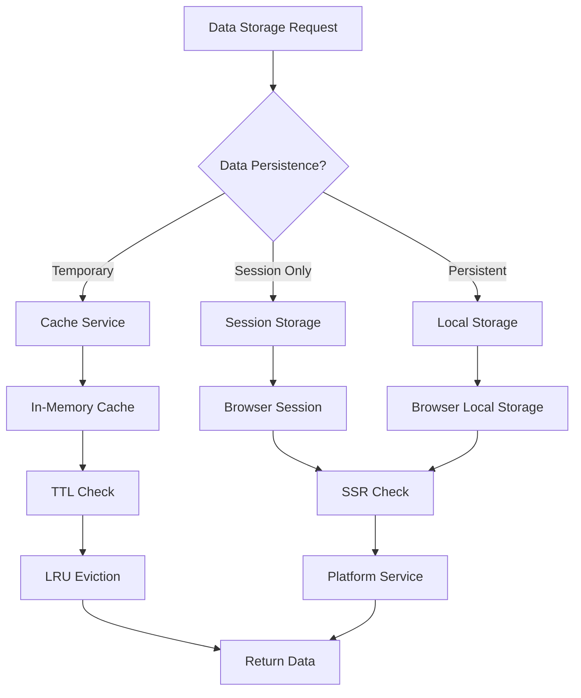
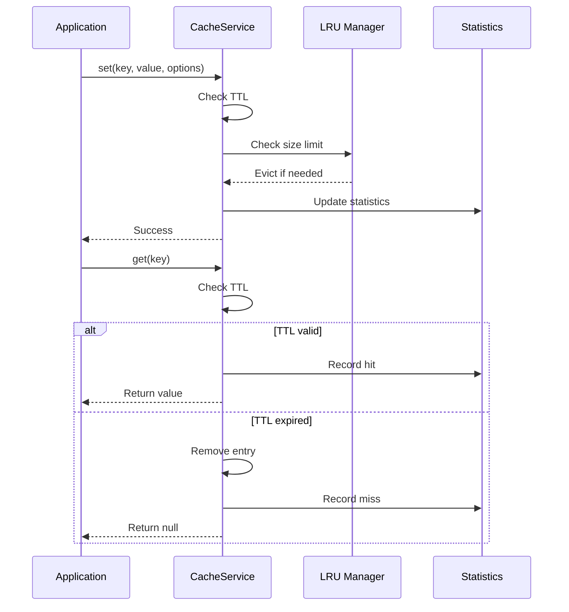

# Storage Module - Hệ thống quản lý lưu trữ dữ liệu

## Giới thiệu

Storage Module cung cấp hệ thống quản lý lưu trữ dữ liệu toàn diện cho ứng dụng Angular, bao gồm cache memory, local storage, session storage với hỗ trợ SSR và type safety. Tài liệu này tập trung vào bốn thành phần chính:

- **Browser Storage Base Interface**: Interface cơ sở cho tất cả storage services
- **Cache Service**: Hệ thống cache memory với TTL và LRU eviction
- **Local Storage Service**: Wrapper cho localStorage với SSR support
- **Session Storage Service**: Wrapper cho sessionStorage với SSR support

## Các thành phần chính

| STT | Thành phần                     | Loại      | Mô tả ngắn                                         |
| --- | ------------------------------ | --------- | -------------------------------------------------- |
| 1   | Browser Storage Base Interface | Interface | Interface cơ sở cho tất cả storage implementations |
| 2   | Cache Service                  | Service   | In-memory cache với TTL và LRU eviction policy     |
| 3   | Local Storage Service          | Service   | SSR-safe wrapper cho localStorage API              |
| 4   | Session Storage Service        | Service   | SSR-safe wrapper cho sessionStorage API            |

### 1. Browser Storage Base Interface

Interface cơ sở định nghĩa API chung cho tất cả storage implementations:

```typescript
export interface BrowserStorageBase<T = any> {
  /**
   * Lưu trữ dữ liệu với key
   * @param key - Storage key
   * @param value - Dữ liệu cần lưu
   * @param options - Tùy chọn lưu trữ (TTL, etc.)
   */
  set(key: string, value: T, options?: StorageOptions): void;

  /**
   * Lấy dữ liệu theo key
   * @param key - Storage key
   * @returns Dữ liệu hoặc null nếu không tồn tại
   */
  get(key: string): T | null;

  /**
   * Kiểm tra key có tồn tại không
   * @param key - Storage key
   * @returns true nếu key tồn tại
   */
  has(key: string): boolean;

  /**
   * Xóa dữ liệu theo key
   * @param key - Storage key
   */
  remove(key: string): void;

  /**
   * Xóa tất cả dữ liệu
   */
  clear(): void;

  /**
   * Lấy danh sách tất cả keys
   * @returns Mảng các keys
   */
  keys(): string[];

  /**
   * Lấy số lượng items trong storage
   * @returns Số lượng items
   */
  get size(): number;
}
```

#### Extended Interfaces

```typescript
/**
 * Interface mở rộng cho cache storage với thống kê
 */
export interface CacheStorageBase<T = any> extends BrowserStorageBase<T> {
  /**
   * Lấy thống kê cache
   * @returns Thông tin thống kê cache
   */
  getStats(): CacheStats;

  /**
   * Thiết lập kích thước tối đa của cache
   * @param maxSize - Kích thước tối đa
   */
  setMaxSize(maxSize: number): void;
}

/**
 * Tùy chọn lưu trữ
 */
export interface StorageOptions {
  /** Time to live in milliseconds */
  ttl?: number;
  /** Metadata bổ sung */
  metadata?: Record<string, any>;
}

/**
 * Thống kê cache
 */
export interface CacheStats {
  /** Số lượng items trong cache */
  size: number;
  /** Số lần truy cập thành công */
  hits: number;
  /** Số lần truy cập thất bại */
  misses: number;
  /** Tỷ lệ hit rate */
  hitRate: number;
  /** Kích thước tối đa */
  maxSize: number;
}

/**
 * Entry trong storage
 */
export interface StorageEntry<T = any> {
  /** Dữ liệu */
  value: T;
  /** Thời gian tạo */
  createdAt: number;
  /** Thời gian hết hạn */
  expiresAt?: number;
  /** Thời gian truy cập cuối */
  lastAccessed: number;
  /** Metadata */
  metadata?: Record<string, any>;
}

/**
 * Event khi storage thay đổi
 */
export interface StorageEvent<T = any> {
  /** Loại event */
  type: "set" | "remove" | "clear";
  /** Key bị thay đổi */
  key?: string;
  /** Giá trị cũ */
  oldValue?: T;
  /** Giá trị mới */
  newValue?: T;
  /** Timestamp */
  timestamp: number;
}

/**
 * Interface cho observable storage
 */
export interface ObservableStorageBase<T = any> extends BrowserStorageBase<T> {
  /**
   * Observable cho storage events
   */
  events$: Observable<StorageEvent<T>>;

  /**
   * Observable cho một key cụ thể
   * @param key - Storage key
   * @returns Observable của giá trị
   */
  watch(key: string): Observable<T | null>;
}
```

### 2. Cache Service

Service quản lý cache memory với TTL và LRU eviction policy:

```typescript
@Injectable({
  providedIn: "root",
})
export class CacheService implements CacheStorageBase<any> {
  private cache = new Map<string, StorageEntry>();
  private accessOrder = new Map<string, number>();
  private stats: CacheStats;
  private maxSize = 100;
  private accessCounter = 0;

  constructor(private platformService: PlatformService) {
    this.stats = {
      size: 0,
      hits: 0,
      misses: 0,
      hitRate: 0,
      maxSize: this.maxSize,
    };
  }

  set(key: string, value: any, options?: StorageOptions): void {
    const now = Date.now();
    const entry: StorageEntry = {
      value,
      createdAt: now,
      lastAccessed: now,
      expiresAt: options?.ttl ? now + options.ttl : undefined,
      metadata: options?.metadata,
    };

    // Xóa entry cũ nếu tồn tại
    if (this.cache.has(key)) {
      this.cache.delete(key);
      this.accessOrder.delete(key);
    }

    // Kiểm tra kích thước tối đa
    if (this.cache.size >= this.maxSize) {
      this.evictLRU();
    }

    this.cache.set(key, entry);
    this.accessOrder.set(key, ++this.accessCounter);
    this.updateStats();
  }

  get(key: string): any | null {
    const entry = this.cache.get(key);

    if (!entry) {
      this.stats.misses++;
      this.updateHitRate();
      return null;
    }

    // Kiểm tra TTL
    if (entry.expiresAt && Date.now() > entry.expiresAt) {
      this.remove(key);
      this.stats.misses++;
      this.updateHitRate();
      return null;
    }

    // Cập nhật last accessed
    entry.lastAccessed = Date.now();
    this.accessOrder.set(key, ++this.accessCounter);

    this.stats.hits++;
    this.updateHitRate();
    return entry.value;
  }

  has(key: string): boolean {
    const entry = this.cache.get(key);
    if (!entry) return false;

    // Kiểm tra TTL
    if (entry.expiresAt && Date.now() > entry.expiresAt) {
      this.remove(key);
      return false;
    }

    return true;
  }

  remove(key: string): void {
    this.cache.delete(key);
    this.accessOrder.delete(key);
    this.updateStats();
  }

  clear(): void {
    this.cache.clear();
    this.accessOrder.clear();
    this.accessCounter = 0;
    this.updateStats();
  }

  keys(): string[] {
    return Array.from(this.cache.keys());
  }

  get size(): number {
    return this.cache.size;
  }

  getStats(): CacheStats {
    return { ...this.stats };
  }

  setMaxSize(maxSize: number): void {
    this.maxSize = maxSize;
    this.stats.maxSize = maxSize;

    // Evict nếu cần
    while (this.cache.size > maxSize) {
      this.evictLRU();
    }
  }

  private evictLRU(): void {
    let oldestKey: string | null = null;
    let oldestAccess = Infinity;

    for (const [key, accessTime] of this.accessOrder) {
      if (accessTime < oldestAccess) {
        oldestAccess = accessTime;
        oldestKey = key;
      }
    }

    if (oldestKey) {
      this.remove(oldestKey);
    }
  }

  private updateStats(): void {
    this.stats.size = this.cache.size;
  }

  private updateHitRate(): void {
    const total = this.stats.hits + this.stats.misses;
    this.stats.hitRate = total > 0 ? this.stats.hits / total : 0;
  }
}
```

### 3. Local Storage Service

SSR-safe wrapper cho localStorage API:

```typescript
@Injectable({
  providedIn: "root",
})
export class LocalStorageService implements BrowserStorageBase<string> {
  constructor(private platformService: PlatformService) {}

  set(key: string, value: string, options?: StorageOptions): void {
    if (!this.platformService.isBrowser()) {
      return;
    }

    try {
      const entry: StorageEntry<string> = {
        value,
        createdAt: Date.now(),
        lastAccessed: Date.now(),
        expiresAt: options?.ttl ? Date.now() + options.ttl : undefined,
        metadata: options?.metadata,
      };

      localStorage.setItem(key, JSON.stringify(entry));
    } catch (error) {
      console.warn("LocalStorage set failed:", error);
    }
  }

  get(key: string): string | null {
    if (!this.platformService.isBrowser()) {
      return null;
    }

    try {
      const item = localStorage.getItem(key);
      if (!item) return null;

      const entry: StorageEntry<string> = JSON.parse(item);

      // Kiểm tra TTL
      if (entry.expiresAt && Date.now() > entry.expiresAt) {
        this.remove(key);
        return null;
      }

      // Cập nhật last accessed
      entry.lastAccessed = Date.now();
      localStorage.setItem(key, JSON.stringify(entry));

      return entry.value;
    } catch (error) {
      console.warn("LocalStorage get failed:", error);
      return null;
    }
  }

  has(key: string): boolean {
    if (!this.platformService.isBrowser()) {
      return false;
    }

    try {
      const item = localStorage.getItem(key);
      if (!item) return false;

      const entry: StorageEntry<string> = JSON.parse(item);

      // Kiểm tra TTL
      if (entry.expiresAt && Date.now() > entry.expiresAt) {
        this.remove(key);
        return false;
      }

      return true;
    } catch (error) {
      return false;
    }
  }

  remove(key: string): void {
    if (!this.platformService.isBrowser()) {
      return;
    }

    try {
      localStorage.removeItem(key);
    } catch (error) {
      console.warn("LocalStorage remove failed:", error);
    }
  }

  clear(): void {
    if (!this.platformService.isBrowser()) {
      return;
    }

    try {
      localStorage.clear();
    } catch (error) {
      console.warn("LocalStorage clear failed:", error);
    }
  }

  keys(): string[] {
    if (!this.platformService.isBrowser()) {
      return [];
    }

    try {
      return Object.keys(localStorage);
    } catch (error) {
      console.warn("LocalStorage keys failed:", error);
      return [];
    }
  }

  get size(): number {
    if (!this.platformService.isBrowser()) {
      return 0;
    }

    try {
      return localStorage.length;
    } catch (error) {
      return 0;
    }
  }
}
```

### 4. Session Storage Service

SSR-safe wrapper cho sessionStorage API:

```typescript
@Injectable({
  providedIn: "root",
})
export class SessionStorageService implements BrowserStorageBase<string> {
  constructor(private platformService: PlatformService) {}

  set(key: string, value: string, options?: StorageOptions): void {
    if (!this.platformService.isBrowser()) {
      return;
    }

    try {
      const entry: StorageEntry<string> = {
        value,
        createdAt: Date.now(),
        lastAccessed: Date.now(),
        expiresAt: options?.ttl ? Date.now() + options.ttl : undefined,
        metadata: options?.metadata,
      };

      sessionStorage.setItem(key, JSON.stringify(entry));
    } catch (error) {
      console.warn("SessionStorage set failed:", error);
    }
  }

  get(key: string): string | null {
    if (!this.platformService.isBrowser()) {
      return null;
    }

    try {
      const item = sessionStorage.getItem(key);
      if (!item) return null;

      const entry: StorageEntry<string> = JSON.parse(item);

      // Kiểm tra TTL
      if (entry.expiresAt && Date.now() > entry.expiresAt) {
        this.remove(key);
        return null;
      }

      // Cập nhật last accessed
      entry.lastAccessed = Date.now();
      sessionStorage.setItem(key, JSON.stringify(entry));

      return entry.value;
    } catch (error) {
      console.warn("SessionStorage get failed:", error);
      return null;
    }
  }

  has(key: string): boolean {
    if (!this.platformService.isBrowser()) {
      return false;
    }

    try {
      const item = sessionStorage.getItem(key);
      if (!item) return false;

      const entry: StorageEntry<string> = JSON.parse(item);

      // Kiểm tra TTL
      if (entry.expiresAt && Date.now() > entry.expiresAt) {
        this.remove(key);
        return false;
      }

      return true;
    } catch (error) {
      return false;
    }
  }

  remove(key: string): void {
    if (!this.platformService.isBrowser()) {
      return;
    }

    try {
      sessionStorage.removeItem(key);
    } catch (error) {
      console.warn("SessionStorage remove failed:", error);
    }
  }

  clear(): void {
    if (!this.platformService.isBrowser()) {
      return;
    }

    try {
      sessionStorage.clear();
    } catch (error) {
      console.warn("SessionStorage clear failed:", error);
    }
  }

  keys(): string[] {
    if (!this.platformService.isBrowser()) {
      return [];
    }

    try {
      return Object.keys(sessionStorage);
    } catch (error) {
      console.warn("SessionStorage keys failed:", error);
      return [];
    }
  }

  get size(): number {
    if (!this.platformService.isBrowser()) {
      return 0;
    }

    try {
      return sessionStorage.length;
    } catch (error) {
      return 0;
    }
  }
}
```

## Cách sử dụng

### Sử dụng Cache Service

```typescript
import { CacheService } from "@cci-web/core/storage";

@Component({
  selector: "app-product-list",
  templateUrl: "./product-list.component.html",
})
export class ProductListComponent implements OnInit {
  products: Product[] = [];

  constructor(private cacheService: CacheService, private productService: ProductService) {}

  ngOnInit() {
    this.loadProducts();
  }

  loadProducts() {
    const cacheKey = "products-list";

    // Kiểm tra cache trước
    const cachedProducts = this.cacheService.get(cacheKey);
    if (cachedProducts) {
      this.products = cachedProducts;
      return;
    }

    // Load từ API và cache kết quả
    this.productService.getProducts().subscribe((products) => {
      this.products = products;
      // Cache trong 5 phút
      this.cacheService.set(cacheKey, products, { ttl: 300000 });
    });
  }

  clearCache() {
    this.cacheService.clear();
  }

  getCacheStats() {
    const stats = this.cacheService.getStats();
    console.log("Cache hit rate:", stats.hitRate);
    console.log("Cache size:", stats.size);
  }
}
```

### Sử dụng Local Storage Service

```typescript
import { LocalStorageService } from "@cci-web/core/storage";

@Injectable({
  providedIn: "root",
})
export class UserPreferencesService {
  constructor(private localStorage: LocalStorageService) {}

  saveUserPreferences(preferences: UserPreferences) {
    this.localStorage.set(
      "user-preferences",
      JSON.stringify(preferences),
      { ttl: 30 * 24 * 60 * 60 * 1000 } // 30 ngày
    );
  }

  getUserPreferences(): UserPreferences | null {
    const data = this.localStorage.get("user-preferences");
    return data ? JSON.parse(data) : null;
  }

  clearUserPreferences() {
    this.localStorage.remove("user-preferences");
  }

  hasUserPreferences(): boolean {
    return this.localStorage.has("user-preferences");
  }
}
```

### Sử dụng Session Storage Service

```typescript
import { SessionStorageService } from "@cci-web/core/storage";

@Injectable({
  providedIn: "root",
})
export class ShoppingCartService {
  constructor(private sessionStorage: SessionStorageService) {}

  saveCart(cart: CartItem[]) {
    this.sessionStorage.set("shopping-cart", JSON.stringify(cart));
  }

  getCart(): CartItem[] {
    const data = this.sessionStorage.get("shopping-cart");
    return data ? JSON.parse(data) : [];
  }

  clearCart() {
    this.sessionStorage.remove("shopping-cart");
  }

  getCartSize(): number {
    const cart = this.getCart();
    return cart.length;
  }
}
```

## Ví dụ sử dụng nâng cao

### Tạo Storage Factory Service

```typescript
import { Injectable } from "@angular/core";
import { BrowserStorageBase } from "@cci-web/core/storage";

export type StorageType = "cache" | "localStorage" | "sessionStorage";

@Injectable({
  providedIn: "root",
})
export class StorageFactory {
  constructor(
    private cacheService: CacheService,
    private localStorageService: LocalStorageService,
    private sessionStorageService: SessionStorageService
  ) {}

  getStorage(type: StorageType): BrowserStorageBase {
    switch (type) {
      case "cache":
        return this.cacheService;
      case "localStorage":
        return this.localStorageService;
      case "sessionStorage":
        return this.sessionStorageService;
      default:
        throw new Error(`Unknown storage type: ${type}`);
    }
  }
}
```

### Tạo Generic Storage Service

```typescript
@Injectable({
  providedIn: "root",
})
export class GenericStorageService<T> {
  constructor(
    private storageFactory: StorageFactory,
    @Inject("STORAGE_TYPE") private storageType: StorageType,
    @Inject("KEY_PREFIX") private keyPrefix: string
  ) {}

  private get storage(): BrowserStorageBase {
    return this.storageFactory.getStorage(this.storageType);
  }

  private getKey(key: string): string {
    return `${this.keyPrefix}:${key}`;
  }

  set(key: string, value: T, options?: StorageOptions): void {
    const serialized = JSON.stringify(value);
    this.storage.set(this.getKey(key), serialized, options);
  }

  get(key: string): T | null {
    const data = this.storage.get(this.getKey(key));
    return data ? JSON.parse(data) : null;
  }

  has(key: string): boolean {
    return this.storage.has(this.getKey(key));
  }

  remove(key: string): void {
    this.storage.remove(this.getKey(key));
  }

  clear(): void {
    const keys = this.storage.keys();
    const prefixedKeys = keys.filter((k) => k.startsWith(this.keyPrefix));
    prefixedKeys.forEach((key) => this.storage.remove(key));
  }
}
```

## Quy trình tương tác

### Storage Selection Flow



### Cache Management Workflow



## Bảng tổng hợp các thành phần

### Tổng quan các Services

| Service               | Storage Type | Persistence | SSR Safe | TTL Support | LRU Eviction |
| --------------------- | ------------ | ----------- | -------- | ----------- | ------------ |
| CacheService          | Memory       | No          | Yes      | Yes         | Yes          |
| LocalStorageService   | Disk         | Yes         | Yes      | Yes         | No           |
| SessionStorageService | Memory       | Session     | Yes      | Yes         | No           |

### So sánh tính năng

| Tính năng             | Cache Service | Local Storage | Session Storage |
| --------------------- | ------------- | ------------- | --------------- |
| **Performance**       | Rất cao       | Trung bình    | Trung bình      |
| **Capacity**          | RAM limit     | ~5-10MB       | ~5-10MB         |
| **Persistence**       | Không         | Có            | Session only    |
| **Cross-tab sharing** | Không         | Có            | Không           |
| **SSR Support**       | Có            | Có            | Có              |
| **Type Safety**       | Generic       | String only   | String only     |
| **Statistics**        | Có            | Không         | Không           |
| **Auto Eviction**     | LRU           | Manual        | Manual          |

### Use Cases phù hợp

| Use Case              | Recommended Storage | Lý do                                |
| --------------------- | ------------------- | ------------------------------------ |
| API Response Caching  | Cache Service       | High performance, TTL, auto eviction |
| User Preferences      | Local Storage       | Persistent across sessions           |
| Shopping Cart         | Session Storage     | Session-specific, auto cleanup       |
| Authentication Tokens | Local Storage       | Persistent, secure                   |
| Temporary Form Data   | Cache Service       | Fast access, auto cleanup            |
| Theme Settings        | Local Storage       | User preference, persistent          |
| Search History        | Local Storage       | User data, cross-session             |
| Current Page State    | Session Storage     | Page-specific, session-only          |

## Ghi chú quan trọng

::: warning Lưu ý quan trọng

- **SSR Compatibility**: Tất cả storage services đều hỗ trợ SSR thông qua PlatformService
- **Error Handling**: Services tự động handle lỗi và log warnings, không throw exceptions
- **Memory Management**: CacheService có LRU eviction để tránh memory leaks
- **Type Safety**: Sử dụng TypeScript generics để đảm bảo type safety
- **TTL Support**: Tất cả services đều hỗ trợ TTL (Time To Live)
- **Performance**: CacheService có performance cao nhất, phù hợp cho frequent access
  :::

## Tóm tắt

Storage Module cung cấp hệ thống lưu trữ dữ liệu toàn diện với ba loại storage chính: in-memory cache, localStorage và sessionStorage. Tất cả đều hỗ trợ SSR, TTL và error handling, đảm bảo ứng dụng hoạt động ổn định trên mọi platform và environment.
