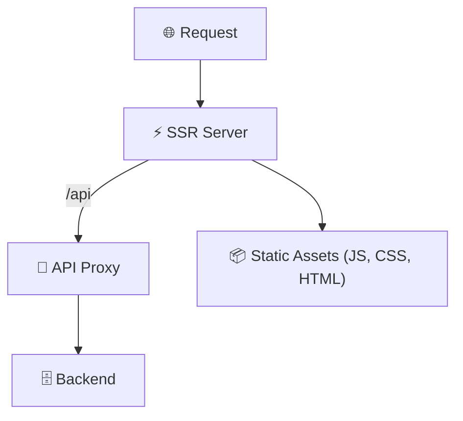

# Tài liệu NodeServer: Cấu hình Angular SSR Server

## Tổng quan

Lớp `NodeServer` cung cấp hạ tầng **dựa trên Express** để chạy ứng dụng Angular với **Server Side Rendering (SSR)**, đồng thời đóng vai trò như một **API reverse proxy**.

Thiết lập này được thiết kế đặc biệt cho **môi trường production**, nơi mà:

- Ứng dụng frontend cần được render phía server
- Các request API backend cần được proxy thông qua lớp SSR

---

## Mục đích chính

Lớp này xử lý 3 chức năng quan trọng trong một cấu hình duy nhất:

1. **Render phía server (SSR)** ứng dụng Angular bằng `CommonEngine`
2. **Proxy API** cho backend dưới các route `/api`
3. **Phục vụ static assets** với caching hợp lý

---

## Tham số cấu hình

| Tham số           | Giá trị mặc định                                            |
| ----------------- | ----------------------------------------------------------- |
| `PORT`            | Từ constructor (`ssrPort`) hoặc biến môi trường `SSR_PORT`  |
| `BACKEND_URL`     | `https://localhost:${backendPort}` (nếu không cấu hình env) |
| `DIST_FOLDER`     | Đường dẫn build Angular                                     |
| `BROWSER_FOLDER`  | Thư mục chứa static assets và `index.html`                  |
| `INDEX_HTML_PATH` | Đường dẫn file `index.server.html`                          |

---

## Thành phần chính & Quy trình

### 1. Nạp cấu hình (`loadConfiguration`)

- Đọc biến môi trường (`BACKEND_URL`, `SSR_PORT`, ...)
- Ưu tiên giá trị từ constructor so với biến môi trường
- Log chi tiết cấu hình để debug
- Thiết lập các đường dẫn chính:
  - `distFolder`: Build Angular
  - `browserFolder`: Static assets

---

### 2. Middleware (`setupMiddleware`)

#### Proxy API

```ts
const apiProxy = createProxyMiddleware({
  target: backendUrl,
  changeOrigin: true,
  secure: false,
});
this.app.use("/api", apiProxy);
```

- Mọi request `/api` sẽ được forward tới backend
- `changeOrigin=true`: đảm bảo header host đúng
- `secure=false`: bỏ qua SSL verification (chỉ dev)

#### Static Assets

```ts
this.app.use(
  express.static(browserFolder, {
    maxAge: "1y",
    index: false,
    setHeaders: (res, filePath) => {
      if (filePath.endsWith(".html")) {
        res.setHeader("Cache-Control", "no-cache, no-store, must-revalidate");
      }
    },
  })
);
```

- Tài nguyên tĩnh cache **1 năm**
- File HTML đặt **no-cache** để tránh nội dung cũ

---

### 3. SSR Handler (`ssrHandler`)

```ts
async ssrHandler(req: Request, res: Response, next: NextFunction) {
  const renderedHtml = await this.commonEngine.render({
    bootstrap: this.bootstrap,
    documentFilePath: indexHtmlPath,
    url: `${protocol}://${headers.host}${originalUrl}`,
    publicPath: browserFolder,
    providers: [{ provide: APP_BASE_HREF, useValue: baseUrl || "/" }]
  });

  res.setHeader("Content-Type", "text/html");
  res.send(renderedHtml);
}
```

- Dùng Angular `CommonEngine` để SSR
- Xử lý protocol, base path, header chuẩn
- Trả về HTML đã render

---

### 4. Route SSR (`setupSSR`)

```ts
this.app.get("*", async (req, res, next) => {
  if (!fs.existsSync(indexHtmlPath)) {
    console.error(`[SSR] index.html not found: ${indexHtmlPath}`);
    res.send("Ứng dụng Angular chưa được build");
    return;
  }
  await this.ssrHandler(req, res, next);
});
```

- Nếu thiếu file `index.server.html` → trả về thông báo
- Nếu có → render SSR

---

## Ví dụ sử dụng

```ts
const nodeServer = new NodeServer(3000, 8080);

nodeServer.loadBootstrap(yourAngularBootstrapFunction);
nodeServer.setupSSR();
nodeServer.setupErrorHandling();
nodeServer.start();
```

---

## Ghi chú & Thực hành tốt

### ✅ Yêu cầu

- Có file `index.server.html` hợp lệ
- Bootstrap Angular được load
- Backend URL phải hoạt động

### ⚠️ Lỗi thường gặp

- Thiếu index → `"Ứng dụng Angular chưa được build"`
- Thiếu bootstrap → SSR lỗi
- Proxy lỗi → được middleware xử lý

### 🔐 Bảo mật

- Proxy **không** xử lý SSL termination (`secure: false`)
- Backend API cần cấu hình CORS chuẩn

---

## Sơ đồ cấu hình



---

## Tóm tắt

Cấu hình `NodeServer` cung cấp:

- **SSR Angular liền mạch**
- **Proxy API** tới backend
- **Caching tối ưu** cho production
- Dùng **ngay lập tức** cho deployment Angular
